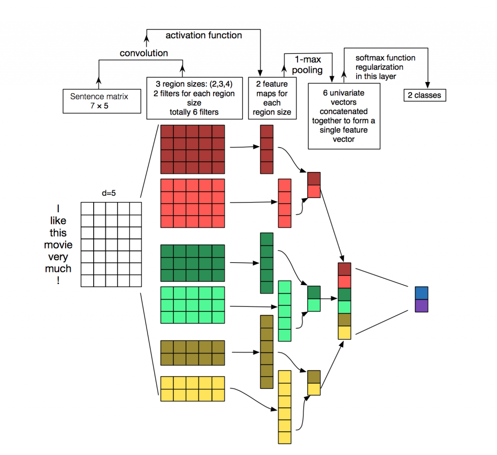

The minimum PaddlePaddle version needed for the code sample in this directory is v0.10.0. If you are on a version of PaddlePaddle earlier than v0.10.0, please [update your installation](http://www.paddlepaddle.org/docs/develop/documentation/en/build_and_install/pip_install_en.html).
____________
# Convolutional Neural Network (CNN) Text Classification
## 简介
____________
针对句子级别的分类任务，论文[1]使用卷积神经网络（CNN）结合预训练的词向量做了一系列的实验。论文[1]证明一个少量调节超参数的简单CNN模型结合静态词向量可以在很多基准上取得非常好的结果。通过细粒度的调节参数学习特定任务的词向量可以进一步的提升结果。同时提出了对架构简单的修改，这样可以同时使用基于特定任务和静态的词向量。此处讨论的CNN模型在7个任务的4个当中取得目前最好的结果，包括情感分类和问题分类。

## 网络结构
____________
模型的架构，如下图所示，是CNN架构[2]的微小变形。

让表示句子中第i个词的k维词向量。一个包含n个单词的句子（必要的时候可以填充）可以表示成：
 
 （1） 

这里表示拼接操作。一般来说让表示单词的拼接。一个卷积操作涉及一个滤波器，应用在一个h个单词的窗口产生一个新的特征。例如，特征是对单词窗口应用如下公式产生的： 

 （2） 

这里b∈R是偏置项，f是一个非线性函数如双曲正切函数。该滤波器应用在句子中

每一个可能的单词窗口产生一个特征映射： 

（3） 

这里。

然后对特征映射采用最大池化策略[3]即取最大的值c=max{c}作为对应此滤波器的特征。此思路是去捕获最重要的特征——每个特征映射中最大的值。最大池化可以自然处理不同的句子长度。 

我们已经描述通过一个滤波器抽取一个特征描述这个过程。使用多个滤波器（不同的窗口大小）的模型可以获取多个特征。这些特征组成了倒数第二层并且传给全连接的softmax层，输出标签的概率分布。

## 文件一览
____________
在本模型复现示例中，包含以下文件

<table>
    <tr>
        <td>文件</td>
        <td>描述</td>
    </tr>
    <tr>
        <td>train.py</td>
        <td>训练脚本</td>
    </tr>
    <tr>
        <td>infer.py</td>
        <td>预测脚本</td>
    </tr>
    <tr>
        <td>config.py</td>
        <td>训练及预测配置脚本</td>
    </tr>
	<tr>
        <td>config.py</td>
        <td>训练及预测配置脚本</td>
    </tr>      
	
</table>

## 数据集
____________
在data文件夹下，执行<code>sh data_prepare.sh</code>即可实现获取数据集，在data文件夹下将出现aclImdb文件夹，该文件夹下将会有用户在imdb上对于电影的评论文本，大小约为900Mb。

## 模型复现
____________
### 数据预处理
在函数<code>to_lodtensor</code>中首先对数据集进行预处理，使其格式符合要求:
<pre><code>
def to_lodtensor(data, place):
    seq_lens = [len(seq) for seq in data]
    cur_len = 0
    lod = [cur_len]
    for l in seq_lens:
        cur_len += l
        lod.append(cur_len)
    flattened_data = np.concatenate(data, axis=0).astype("int64")
    flattened_data = flattened_data.reshape([len(flattened_data), 1])
    res = fluid.LoDTensor()
    res.set(flattened_data, place)
    res.set_lod([lod])
    return res
</pre></code>

### 载入词典
在函数<code>load_vocab</code>中，实现将imdb的词典的载入，将文本进行初步处理：
<pre><code>
def load_vocab(filename):
    vocab = {}
    with open(filename) as f:
        for idx, line in enumerate(f):
            vocab[line.strip()] = idx
    return vocab
</pre></code>

### 网络结构定义
在函数<code>conv_net</code>中，按照文章[1]的结构，定义了文本CNN神经网络，window的大小定义为3:
<pre><code>
def conv_net(dict_dim,
             window_size=3,
             emb_dim=128,
             num_filters=128,
             fc0_dim=96,
             class_dim=2):

    data = fluid.layers.data(
        name="words", shape=[1], dtype="int64", lod_level=1)

    label = fluid.layers.data(name="label", shape=[1], dtype="int64")

    emb = fluid.layers.embedding(input=data, size=[dict_dim, emb_dim])

    conv_3 = fluid.nets.sequence_conv_pool(
        input=emb,
        num_filters=num_filters,
        filter_size=window_size,
        act="tanh",
        pool_type="max")

    fc_0 = fluid.layers.fc(input=[conv_3], size=fc0_dim)

    prediction = fluid.layers.fc(input=[fc_0], size=class_dim, act="softmax")

    cost = fluid.layers.cross_entropy(input=prediction, label=label)

    avg_cost = fluid.layers.mean(x=cost)

    return data, label, prediction, avg_cost

</pre></code>

### 主函数
在主函数实现训练过程，同时打印每次训练的cost：
<pre><code>
    for pass_id in xrange(conf.num_passes):
        train_pass_acc_evaluator.reset()
        start_time = time.time()
        for batch_id, data in enumerate(train_reader()):
            cost_val, acc_val, size_val = exe.run(
                fluid.default_main_program(),
                feed=feeder.feed(data),
                fetch_list=[avg_cost, batch_acc_var, batch_size_var])
            train_pass_acc_evaluator.add(value=acc_val, weight=size_val)
            if batch_id and batch_id % conf.log_period == 0:
                print("Pass id: %d, batch id: %d, cost: %f, pass_acc: %f" %
                      (pass_id, batch_id, cost_val,
                       train_pass_acc_evaluator.eval()))
        end_time = time.time()
        total_time += (end_time - start_time)
        pass_test_acc = test(exe)
        print("Pass id: %d, test_acc: %f" % (pass_id, pass_test_acc))

</pre></code>
### 模型训练
在终端中执行<code>python train.py --dict_path 'data/aclImdb/imdb.vocab'</code>，执行训练过程，终端输出如下所示：

<pre><code>

Pass id: 1, batch id: 5900, cost: 1.094884, pass_acc: 0.781732

Pass id: 1, batch id: 6000, cost: 0.867171, pass_acc: 0.782620

Pass id: 1, batch id: 6100, cost: 0.190018, pass_acc: 0.782945

Pass id: 1, batch id: 6200, cost: 0.225717, pass_acc: 0.783059

Pass id: 1, test_acc: 0.820560

Pass id: 2, batch id: 100, cost: 0.172085, pass_acc: 0.836634

Pass id: 2, batch id: 200, cost: 0.425561, pass_acc: 0.825871

Pass id: 2, batch id: 300, cost: 0.201359, pass_acc: 0.833887

</code></pre>

最终终端输出<code>Total train time: XXX (ms)</code>

### 模型预测
在终端执行<code>python infer.py --dict_path 'data/aclImdb/imdb.vocab'</code>，执行预测过程，终端最终输出如下所示：
<pre><code>
The dictionary size is : 89528
Done Inferring.

------------------------->     Profiling Report     <-------------------------

Place: CUDA
Time unit: ms
Sorted by total time in descending order in the same thread

Event                      Calls       Total       Min.        Max.        Ave.        
thread0::uniform_random    4           14.1762     0.026592    13.9847     3.54405  
</pre></code>
此时预测过程完成。

## 参考文献
-------------------
[1] [Convolutional Neural Networks for Sentence Classification](https://arxiv.org/pdf/1408.5882.pdf)

[2] [Tensorflow版TextCNN主要代码解析](http://blog.csdn.net/u013818406/article/details/69530762)

[3] [Recurrent Neural Network for Text Classification with Multi-Task Learning](https://www.ijcai.org/Proceedings/16/Papers/408.pdf)

[4] [Recurrent Neural Network for Text Classification with Multi-Task Learning](http://www.wildml.com/2015/12/implementing-a-cnn-for-text-classification-in-tensorflow/)
